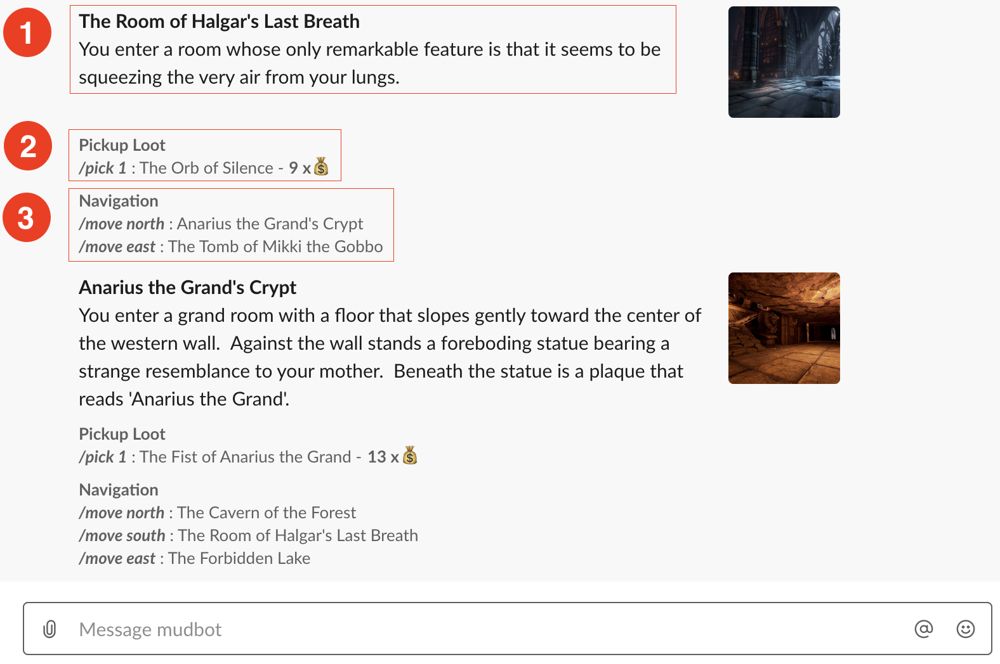

# hackathon-team-c

Team Members:
- Megan Barton
- Shawn Carr
- Lae Kettavong
- Travis Stodter
- Matt Thomson

Project: Multi User Dungeon

This hackathon project is to create a dungeon game that can be played via slack.

## Change Log
 - [12.13.19 - Lae Kettavong] Updated current room state view to include other players in the room for `/look` and `/move` commands. Updated handler for `/alert` to support targeted Slack user name and message to send. 
 - [11.18.19 - Lae Kettavong] Added support for Slack `/look` and `/alert` commands. 
 - [11.5.19 - Lae Kettavong] Small tweak to dungeon schema to incude room image, reworked Slack response for `/move` command so to include (1) room description, (2) items up for grab and (3) navigation options as captured below. 

